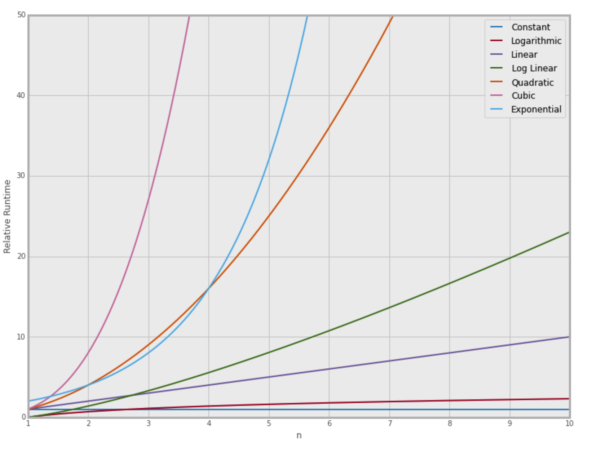

# Algorithm Analysis and Big O

Big O is for comparing algorithms.
Even if we could of know the time by using `%timeit` function,
but due to different hardware situations, by comparing the time of an algorithm, time might not be what we want exactly.

Thus, we have Big O!

- O(1)      - constant
- O(logn)   - logarithmic
- O(n)      - linear
- O(nlogn)  - log linear
- O(n^2)    - quadratic
- O(n^3)    - cubic
- O(2^n)    - exponential

